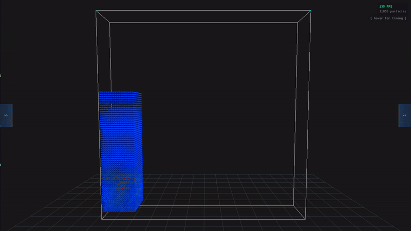
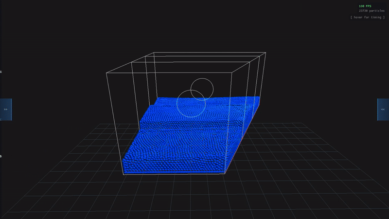
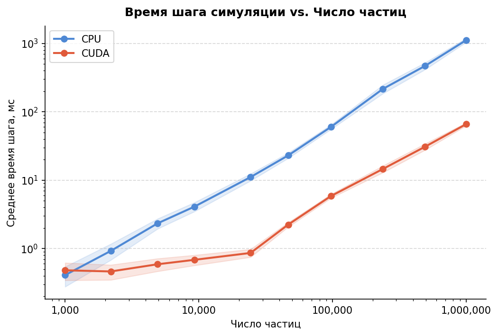
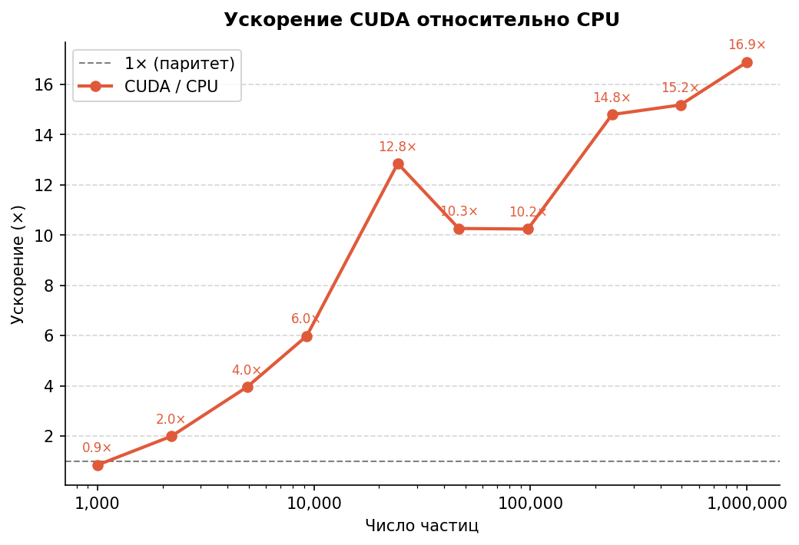

# Interactive GPU Fluid Simulator (Position Based Fluids)

Программный комплекс для интерактивного 3D-моделирования жидкости в реальном времени. Симулятор основан на бессеточном лагранжевом методе **Position Based Fluids (PBF)** и поддерживает вычисления как на **GPU (CUDA)**, так и на **CPU (OpenMP)**.

## Демонстрация работы

<p align="center">
  <br>
  <i>Тестовая сцена «Прорыв дамбы» — классический бенчмарк для гидродинамики.</i>
</p>


<p align="center">
  <br>
  <i>Динамика жидкости в движущемся резервуаре: жидкость перетекает через перегородки при вращении сосуда.</i>
</p>


## Производительность

В рамках проекта проведено профилирование вычислительных бэкендов. Измерения производительности проводились на следующей конфигурации:
- **GPU:** NVIDIA GeForce RTX 4080 (9728 ядер CUDA)
- **CPU:** AMD Ryzen 7 5800X3D (8 ядер, 16 потоков)


*Зависимость времени кадра от количества частиц в сцене.*


*Кратное ускорение вычислений на архитектуре CUDA по сравнению с многопоточной CPU-реализацией.*

## Структура проекта

Исходный код разделен на модули и находится в директории `src/`:

* `app/` и `common/` — Управление жизненным циклом приложения, конфигурация и состояния.
* `bench/` — Инструментарий для профилирования и экспорта результатов бенчмарков.
* `sim/`, `simCPU/`, `simCUDA/` — Вычислительное ядро симуляции. `simCUDA` содержит оптимизированные ядра (kernels) для расчета плотности, поиска соседей и интеграции.
* `scene/` — Генерация стартовых сцен и граничных условий.
* `gui/`, `Input/`, `render/` — Пользовательский интерфейс (Dear ImGui), рендеринг (OpenGL) и обработка ввода.

## Управление камерой и сценой

Интерфейс на базе ImGui позволяет переключать сцены и настраивать параметры на лету.

**Горячие клавиши и мышь:**
- `ЛКМ` (удержание) — Вращение камеры вокруг сцены.
- `ПКМ` (удержание) — Интерактивное вращение сосуда с жидкостью.
- `Колесико мыши` — Масштабирование камеры (Zoom).
- `Space` — Пауза / возобновление симуляции.
- `Стрелка вправо` — Шаг симуляции на один кадр (в режиме паузы).
- `R` — Сброс текущей сцены в начальное состояние.

## Сборка и запуск

Проект использует `CMake FetchContent` для автоматической загрузки библиотек (Eigen3, GLM, GLFW, GLAD, ImGui), поэтому вручную их устанавливать не нужно.

**Системные требования:**
* **CMake** (3.20+)
* Компилятор с поддержкой **C++20**
* **NVIDIA CUDA Toolkit 12.8**
* **OpenGL** драйверы и **OpenMP** (для CPU-бэкенда)

**Инструкция по сборке:**

1. Склонируйте репозиторий:
   ```bash
   git clone https://github.com/R1sedge/Interactive-pbf-sim.git
   cd Interactive-pbf-sim
   ```

2. Сгенерируйте файлы проекта:
   ```bash
   mkdir build && cd build
   cmake ..
   ```

3. Соберите проект в режиме `Release` для максимальной производительности:
   ```bash
   cmake --build . --config Release
   ```

4. Запустите симулятор:
   ```bash
   # Для Windows:
   Release\Simulation.exe
   
   # Для Linux:
   ./Simulation
   ```